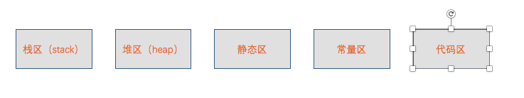
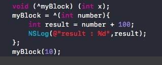
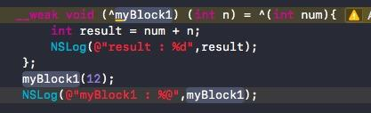
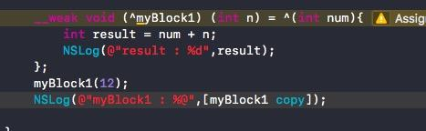
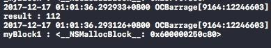
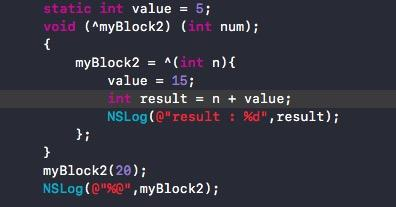
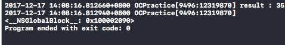
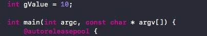
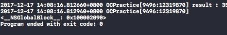

## 内存管理

#### 一、前言：

 Block是Objective-C中的一项强大的特性，Block可以看作是OC中对于闭包函数的实现，实质上Block也是一个对象~

#### 二、内存分配区域：

**OC中的各个主要的内存分配区域：包括有--栈区、堆区、常量区、全局静态区、文本区（代码区）**

内存分配区域

栈区：存放函数参数值、局部变量、函数返回地址等，我们每次调用函数，都会执行压栈操作(在XCode的左侧面板会看到一堆的函数调用栈)。特点是存取效率高，存取结构连续，但是空间很小，有系统自行分配以及管理栈的地址空间。

堆区：这个使我们开发者需要重点关注的内存区域，因为平时涉及到内存管理基本上出自于这个区域。由malloc、alloc、copy(深复制)、new等方法触发的效果就是在堆区进行内存分配。在ARC的环境下，系统帮助我们根据对象的引用计数去管理这个区域的内存分配以及是释放，但我们也要时刻注意该区域的内存使用情况；而在MRC的环境下则需要开发者时时刻刻注意这个区域的内存使用情况，否则后果你懂的~

静态区：该区域其实细分为数据区以及BSS区。数据区存放已经初始化好的静态变量以及全局变量，而BSS区则存放还没有初始化好的静态变量以及全局变量，由系统负责释放以及分配。

常量区：存放常量，由系统释放以及分配。

代码区 (文本区) ：存放函数体代码。

#### 三、Block的三种分类：

**全局区的Block：__NSGlobalBlock__；**

**栈区的Block：__NSStackBlock__；**

**堆区的Block：__NSMallocBlock__；**

1、**__NSGlobalBlock__：**

**当我们声明一个block时，如果这个block没有捕获外部的变量，那么这个block就位于全局区，此时对NSGlobalBlock的retain、copy、release操作都无效。ARC和MRC环境下都是如此。**

如图所示，声明并且定义一个全局区的block

2、**__NSStackBlock__：**

  **这里可能有人会问，平时编程的时候很少遇到位于栈区的block，为什么呢？因为在ARC环境下，当我们声明并且定义了一个block，并且没有为Block添加额外的修饰符（默认是__strong修饰符），如果该Block捕获了外部的变量，实质上是有一个从__NSStackBlock__转变到__NSMallocBlock__的过程，只不过是系统帮我们完成了copy操作，将栈区的block迁移到堆区，延长了Block的生命周期。对于栈区block而言，栈block在当函数退出的时候，该空间就会被回收。**

   **那什么时候在ARC的环境下出现__NSStackBlock__呢？如果我们在声明一个block的时候，使用了__weak或者__unsafe__unretained的修饰符，那么系统就不会为我们做copy的操作，不会将其迁移到堆区。下面我们实验一下：**

如上图所示，被__weak修饰的myBlock1捕获了外部变量n，成为一个栈区的block

默认修饰符环境下，捕获了外部变量的block位于堆区

我们可以手动地去执行copy方法，验证系统为我们做的隐式转换：

如图所示，手动执行copy方法之后，block被迁移到了堆区

3、**__NSMallocBlock__：**

**在MRC环境下，我们需要手动调用copy方法才可以将block迁移到堆区，而在ARC环境下，__strong修饰的（默认）block只要捕获了外部变量就会位于堆区，NSMallocBlock支持retain、release，会对其引用计数＋1或 -1。声明以及定义位于堆区的block如上图所示。**

#### **四、block对不同类型的外部变量的存取：**

1、众所周知，对于block捕获的外部变量，block 默认是将其复制到其数据结构中来实现访问的，因此，对于捕获的普通的外部变量，block并不能作出修改。我们要改变外部变量的内存地址，也就是使用__block修饰符将外部变量在栈中指针的内存地址，迁移到堆区中来。为什么要这样设计呢，我们引用@ChenYiLong的一句话：

> Apple这样设计，应该是考虑到了block的特殊性，block也属于“函数”的范畴，变量进入block，实际就是已经改变了作用域。在几个作用域之间进行切换时，如果不加上这样的限制，变量的可维护性将大大降低。又比如我想在block内声明了一个与外部同名的变量，此时是允许呢还是不允许呢？只有加上了这样的限制，这样的情景才能实现。于是栈区变成了红灯区，堆区变成了绿灯区。

因此，__block修饰符的根本操作就是改变外部变量的内存地址，并不是简单地使得写操作生效。

2、此外，如果将block捕获的外部变量使用static修饰或者将外部变量声明为全局变量，那么block是可以直接修改该外部变量的，因为全局变量或静态变量在内存中的地址是固定的（存放于上文中的静态区），Block在读取该变量值的时候是直接从其所在内存读出，获取到的是最新值，而不是在定义时copy的常量。

如上图所示，捕获了静态变量以及全局变量的block可以直接修改它们的值，要注意的是，虽然此时block捕获了外部变量，但是仍然是位于全局区的block。