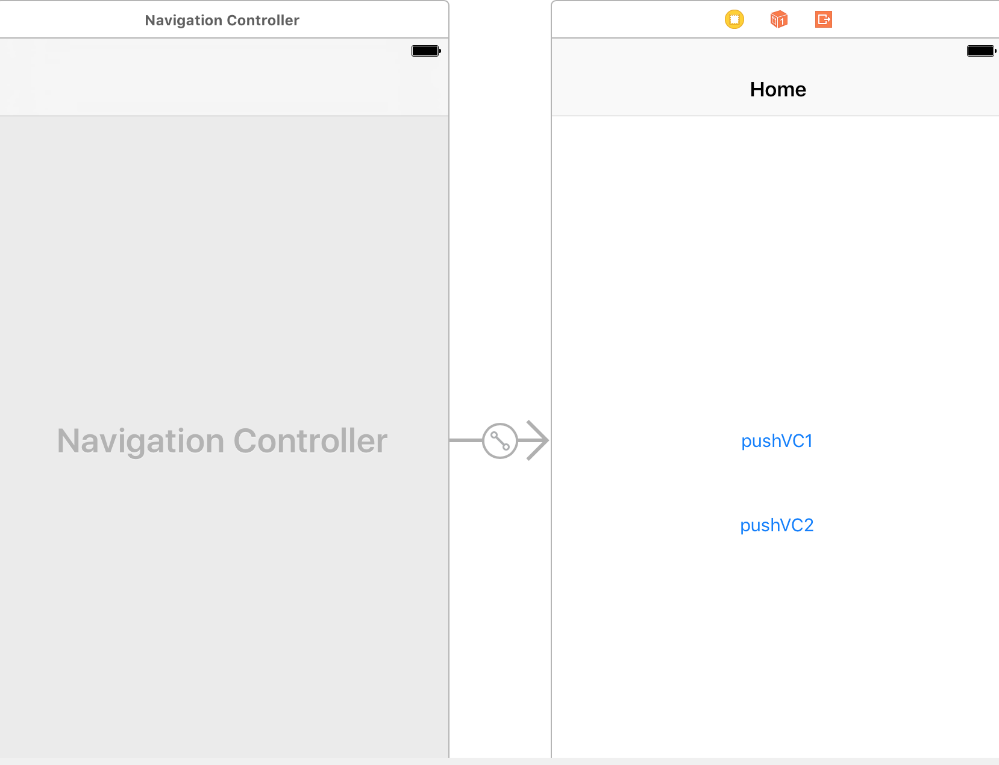

## 循环引用


# 前言

iOS中使用block你一定会遇到循环引用问题，解决的办法也很简单使用weak弱引用，但对于很多的开发者对于weak滥用，而且weak self并不是没有开销的一件事情，同时导致一系列问题，所以本文将通过几种场景来分析，在常见的场景中哪些必须使用**weak** 哪些不使用。如有错误或不妥欢迎留言
 代码在[Github Example](https://link.jianshu.com?t=https://github.com/JarvanZhang007/weakSelfScenesUsingBlock)
 **【注意】** 本篇主要讲解的是ARC下实用场景，想要了解block原理的朋友请参考[谈Objective-C block的实现 唐巧](https://link.jianshu.com?t=http://blog.devtang.com/2013/07/28/a-look-inside-blocks/)

# 常用场景

> UINavigationController两页面传递参数使用block
>  UIViewAnimationWithBlocks 执行动画的block
>  GCD的block
>  NSArray enumerateObjectsUsingBlock
>  MJRefreshHeader 下拉刷新的block
>  AFNetworking 的Block

# 场景分析

#### UINavigationController Scene

[代码这里](https://link.jianshu.com?t=https://github.com/JarvanZhang007/weakSelfScenesUsingBlock/tree/master/JVNavigationControlScene)
 首先我们在Main.storyboard中创建一个UINavigationViewController
 指定一个rootViewController



pushVC1跳转使用weak的实例 【scene1ViewController】


scene1ViewController代码如下

```
class scene1ViewController: UIViewController {

    @IBOutlet weak var textLabel: UILabel!
    //持有下一个VC 出现在下一个VC需要频繁使用并且需要很多时间去加载的情况，让下一个VC的生命周期保持跟当前一致
    var nextVC:nextViewController?
    
    
    override func viewDidLoad() {
        super.viewDidLoad()
    }

    override func didReceiveMemoryWarning() {
        super.didReceiveMemoryWarning()
    }
    
    
    @IBAction func pushClick(_ sender: UIButton) {
            if nextVC == nil {
            //获取storyboard中的 ViewController
            let story = UIStoryboard.init(name: "Main", bundle: nil)
            nextVC = story.instantiateViewController(withIdentifier: "nextViewController") as? nextViewController
            
            nextVC?.testBlock={[weak self] (param:String) in
                self?.doSomething(str: param)
            }
        }
        self.navigationController?.pushViewController(nextVC!, animated: true)
    }
    
    @IBAction func popClick(_ sender: UIButton) {
        _ = self.navigationController?.popViewController(animated: true)
    }
    
    
    func doSomething(str:String){
        self.textLabel.text=str
    }
    
    
    deinit {
        print("scene1ViewController deinit")
    }
}
```

###### nextViewController 代码如下

```
    var testBlock:((_ para:String)->Void)?
    
    override func viewDidLoad() {
        super.viewDidLoad()
        self.title="第三个控制器"
    }

    override func didReceiveMemoryWarning() {
        super.didReceiveMemoryWarning()
        // Dispose of any resources that can be recreated.
    }
    
    @IBAction func popClick(_ sender: UIButton) {
        if self.testBlock != nil {
            self.testBlock?("next return String")
        }
       _ = self.navigationController?.popViewController(animated: true)
    }
```

###### 在每一个ViewController都重写deinit方法

类似objective-c (void)dealloc 可以监控当前VC在pop之后是否释放

```
    deinit {
        print("scene1ViewController deinit")
    }
    deinit {
        print(" nextViewController deinit")
    }
```

运行起来可以看到只有当scene1ViewController pop的时候nextViewController和scene1ViewController 同时释放并打印

> scene1ViewController deinit
>  nextViewController deinit

这种场景下就要使用weak，你可以尝试不使用weak查看 deinit 的打印情况

###### 分析在scene1 VC中持有了nextVC、同时代码block中出现了self相关的属性和方法 ，则nextViewController 使用属性持有了scene1  造成 **循环引用** 

> scene1VC-> nextVC
>  nextVC->self.dosomething

```
 nextVC?.testBlock={[weak self] (param:String) in
            self?.doSomething(str: param)
        }
```

pushVC2跳转**不使用**weak的实例 【scene2ViewController】


scene2ViewController代码如下

```
class scene2ViewController: UIViewController {

    @IBOutlet weak var textLabel: UILabel!
    
    
    override func viewDidLoad() {
        super.viewDidLoad()
        self.title="不使用weak Scene"
    }
    
    override func didReceiveMemoryWarning() {
        super.didReceiveMemoryWarning()
    }
    
    
    @IBAction func pushClick(_ sender: UIButton) {
        //获取storyboard中的 ViewController
        let story = UIStoryboard.init(name: "Main", bundle: nil)
       let nextVC = story.instantiateViewController(withIdentifier: "nextViewController") as! nextViewController
        
        nextVC.testBlock={(param:String) in
            self.doSomething(str: param)
        }
        
        self.navigationController?.pushViewController(nextVC, animated: true)
        
    }
    
    @IBAction func popClick(_ sender: UIButton) {
        _ = self.navigationController?.popViewController(animated: true)
    }
    
    
    func doSomething(str:String){
        self.textLabel.text=str
    }
    
    
    deinit {
        print("scene2ViewController deinit")
    }
}
```

##### 为什么当前这种模式不需要呢？

> navigationController ->scene2 VC
>  navigationController ->nextViewController
>  nextViewController ->Scene2 VC

在scene2 VC 中没有持有 nextViewController，nextViewController是由navigationController持有 ,nextViewController虽然持有了Scene2 VC  nextViewController 在pop 的时候执行完这个block 就会销毁，能正常释放。
 **不会循环引用**

#### UIViewAnimationWithBlocks 执行动画的block

我们经常看到如下代码

```
[UIView animateWithDuration:0.25 animations:^{
        self.testView.frame=CGRectMake(80, 100, self.testView.frame.size.width, self.testView.frame.size.height);
    }];
```

这里是可以直接写self的，因为这是一个类方法，当前的self并没有直接或间接持有这个block。不会循环引用 引用示意图

> animation framework -> block
>  block -> self

#### GCD的block 跟UIViewAnimationWithBlocks同一个道理self并不会持有block, 所以不会循环应用

> GCD -> block
>  block -> self

#### NSArray enumerateObjectsUsingBlock 也不会引起循环引用

```
 [self.dataArray enumerateObjectsUsingBlock:^(NSString *str, NSUInteger idx, BOOL * _Nonnull stop) {
        [self dosomething:str];
    }];
```

> Foundation framework-> block
>  block -> self

#### MJRefreshHeader 下拉刷新的block

```
    //下拉刷新
    WEAKSELF;
    self.tableView.mj_header=[MJRefreshNormalHeader headerWithRefreshingBlock:^{
        [weakSelf dosomething];
    }];
```

在这个实例中，我是使用weakSelf的原因是什么呢？

> self->tableView
>  self.tableView->mj_header
>  mj_header.block->self

#### AFNetworking 的Block

[测试代码](https://link.jianshu.com?t=https://github.com/JarvanZhang007/weakSelfScenesUsingBlock/tree/master/AFNetworingBlockScene)
 鉴于当前这个时间节点，大家都是使用AFNetworking 3.X的版本，所以当前分析基于3.0以上版本

```
    AFHTTPSessionManager *session = [AFHTTPSessionManager manager];
    
    [session GET:testURL parameters:nil progress:nil success:^(NSURLSessionDataTask * _Nonnull task, id  _Nullable responseObject) {
        NSLog(@"请求成功---%@", responseObject);
        self.testLabel.text=@"成功";
    } failure:^(NSURLSessionDataTask * _Nullable task, NSError * _Nonnull error) {
        NSLog(@"%@",error);
    }];
```

AFNetworking 中success block 和failure block 通过如下调用栈 设置到一个delegate的对象上


摘录AFNetworking 方便大家在源码中搜索

```
- (void)addDelegateForDataTask:(NSURLSessionDataTask *)dataTask
                uploadProgress:(nullable void (^)(NSProgress *uploadProgress)) uploadProgressBlock
              downloadProgress:(nullable void (^)(NSProgress *downloadProgress)) downloadProgressBlock
             completionHandler:(void (^)(NSURLResponse *response, id responseObject, NSError *error))completionHandler
{
    AFURLSessionManagerTaskDelegate *delegate = [[AFURLSessionManagerTaskDelegate alloc] init];
    delegate.manager = self;
    delegate.completionHandler = completionHandler;

    dataTask.taskDescription = self.taskDescriptionForSessionTasks;
    [self setDelegate:delegate forTask:dataTask];

    delegate.uploadProgressBlock = uploadProgressBlock;
    delegate.downloadProgressBlock = downloadProgressBlock;
}
```

在NSURLSessionTaskDelegate 的执行这个block

```
#pragma mark - NSURLSessionTaskDelegate

- (void)URLSession:(__unused NSURLSession *)session
              task:(NSURLSessionTask *)task
didCompleteWithError:(NSError *)error
{
........此处省略
            dispatch_group_async(manager.completionGroup ?: url_session_manager_completion_group(), manager.completionQueue ?: dispatch_get_main_queue(), ^{
                if (self.completionHandler) {
                    self.completionHandler(task.response, responseObject, serializationError);
                }
........此处省略
}
```

通过大致分析

> AFHTTPSessionManager -> AFURLSessionManagerTaskDelegate
>  AFURLSessionManagerTaskDelegate ->ViewController  block

未发生循环引用问题 所以可以直接使用self

注意 如下代码 有隐藏的内存泄漏问题

```
AFHTTPSessionManager *session = [AFHTTPSessionManager manager];
```

感兴趣的朋友请翻阅如下链接，不再本文讨论之列
 [NSURLSession is holding a strong reference to its delegate ](https://link.jianshu.com?t=https://github.com/facebook/AsyncDisplayKit/issues/763)
 [Possible memory leak in AFURLSessionManager](https://link.jianshu.com?t=https://github.com/AFNetworking/AFNetworking/issues/1528)