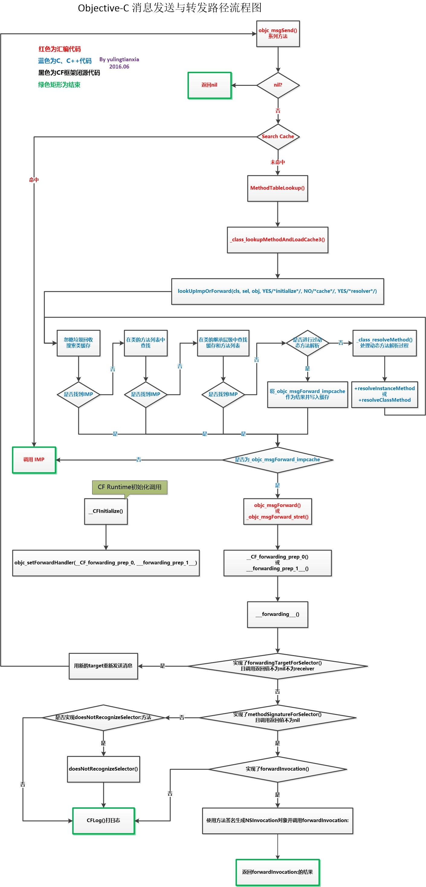

## 消息转发流程

在iOS开发过程中，我们经常会遇到这样的报错：unrecognized selector sent to instance **，因为调用了一个不存在的方法。消息接收者找不到对应的selector，就会启动消息转发机制，如果还是没能处理最后会抛出上述异常。
 其中[Objective-C 消息发送与转发机制原理](https://link.jianshu.com?t=http%3A%2F%2Fyulingtianxia.com%2Fblog%2F2016%2F06%2F15%2FObjective-C-Message-Sending-and-Forwarding%2F)
 中的流程图总结的完整清晰，值得学习。（图片转自Objective-C 消息发送与转发机制原理[http://yulingtianxia.com/blog/2016/06/15/Objective-C-Message-Sending-and-Forwarding/](https://link.jianshu.com?t=http%3A%2F%2Fyulingtianxia.com%2Fblog%2F2016%2F06%2F15%2FObjective-C-Message-Sending-and-Forwarding%2F)）

