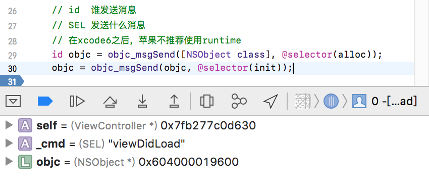
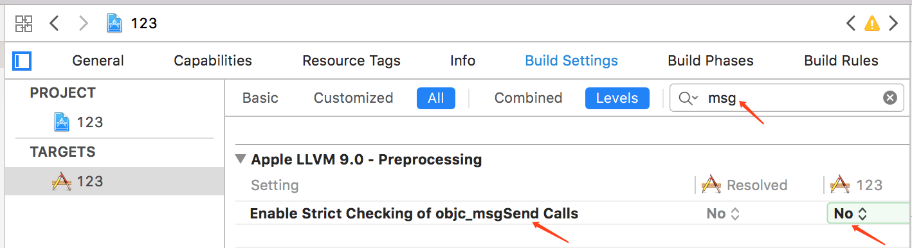
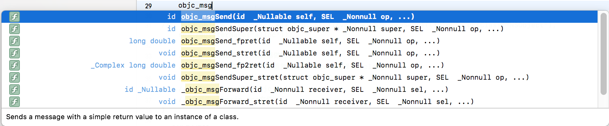
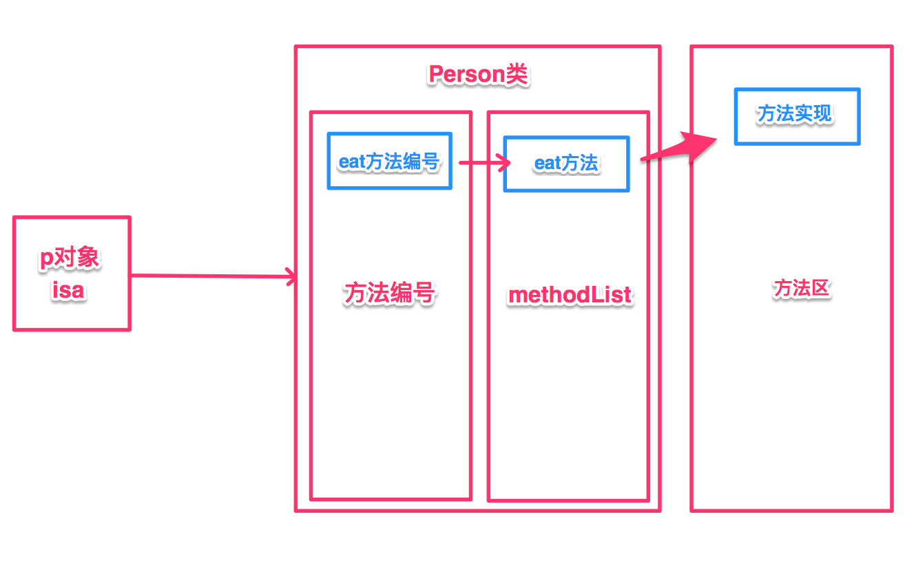
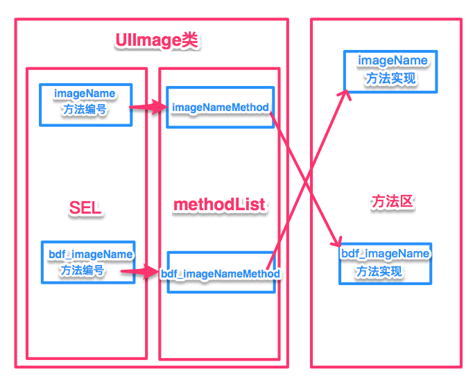

##Runtime

##### 一.runtime简介

- runtime简称运行时，OC就是`运行时机制`，也就是在运行时候的一些机制，其中最主要的是消息机制。
- 对于C语言，`函数的调用在编译时会决定调用哪个函数`。
- 对于OC的函数，属于`动态调用过程`，在编译的时候不能决定真正调用哪个函数，只有在真正运行的时候才会根据函数的名称找到对应的函数来调用。
- 事实证明：
   ① 在编译阶段：OC可以调用任何函数，即使这个函数并未实现，只要声明过就不会报错。
   ② 在编译阶段：C语言调用`未实现的函数`就会报错。

**runtime的五个功能**

> 1.发送消息
>  2.交换方法
>  3.动态添加方法
>  4.给分类添加属性
>  5.字典转模型

- 方法调用的本质，就是让对象发送消息。
- objc_msgSend,只有对象才能发送消息，因此以objc开头。
- 使用`消息机制`前提，必须导入**#import <objc/runtime.h>** 
- 消息机制简单使用。
- clang-rewrite-objc main.m查看最终生成代码。

##### 二.Runtime(消息机制)

消息机制是OC中是最主要的机制，任何方法的调用本质都是**发送消息**，用runtime发送消息，OC底层通过runtime来实现。
 **验证:**
 `是否真的是转换为消息机制`
 第一步：cd进入到该文件夹
 第二步：在终端执行**clang -rewrite-objc 文件名** 命令
 第三步：该命令成功后就会生成一个.cpp的文件。

```
allisondeMacBook-Pro:123 allison$ clang -x objective-c -rewrite-objc -isysroot /Applications/Xcode.app/Contents/Developer/Platforms/iPhoneSimulator.platform/Developer/SDKs/iPhoneSimulator.sdk ViewController.m
clang: warning: using sysroot for 'iPhoneSimulator' but targeting 'MacOSX' [-Wincompatible-sysroot]
/var/folders/nm/4974_cj15s5gyjfg8wj077qm0000gn/T/ViewController-78b550.mi:12798:188: warning: 
      'kCFCalendarUnitWeek' is deprecated: first deprecated in macOS 10.10 - Use
      kCFCalendarUnitWeekOfYear or kCFCalendarUnitWeekOfMonth instead
      [-Wdeprecated-declarations]
  ...or NSCalendarUnitWeekOfYear, depending on which you mean"))) = kCFCalend...
                                                                    ^
/var/folders/nm/4974_cj15s5gyjfg8wj077qm0000gn/T/ViewController-78b550.mi:5147:2: note: 
      'kCFCalendarUnitWeek' has been explicitly marked deprecated here
 kCFCalendarUnitWeek __attribute__((availability(macos,introduced=10.4,d...
 ^
1 warning generated.
```

查看ViewController.cpp文件，我们发现有**64871**行代码，查找**viewDidLoad**方法，我们看.cpp文件中viewDdiload方法中生成的代码：

```
// @implementation ViewController

static void _I_ViewController_viewDidLoad(ViewController * self, SEL _cmd) {
    ((void (*)(__rw_objc_super *, SEL))(void *)objc_msgSendSuper)((__rw_objc_super){(id)self, (id)class_getSuperclass(objc_getClass("ViewController"))}, sel_registerName("viewDidLoad"));


    id objc = ((NSObject *(*)(id, SEL))(void *)objc_msgSend)((id)objc_getClass("NSObject"), sel_registerName("alloc"));
    objc = ((id (*)(id, SEL))(void *)objc_msgSend)((id)objc, sel_registerName("init"));

}
```

我们**ViewController.m**写的代码

```
- (void)viewDidLoad {
    [super viewDidLoad];
    // Do any additional setup after loading the view, typically from a nib.
    
    id objc = [NSObject alloc];
    objc = [objc init];
}
```

例子：运用运行时去创建一个NSObject对象。(我们可以参考ViewController.cpp类里面的viewDidLoad方法)

```
    id objc = ((NSObject *(*)(id, SEL))(void *)objc_msgSend)((id)objc_getClass("NSObject"), sel_registerName("alloc"));
    objc = ((id (*)(id, SEL))(void *)objc_msgSend)((id)objc, sel_registerName("init"));
```

上面这个是最底层的，下面我们可以用苹果封装好的方法，效果是一样的：

```
    id objc = objc_msgSend([NSObject class], @selector(alloc));
    objc = objc_msgSend(objc, @selector(init));
```

这里，从控制台我们可以发现，我们已经分配内存，并且没有错误。




**Tips1**

本来想在main函数中试验，但是在main函数中的时候，使用 `allison$ clang -rewrite-objc main.m`命令的时候总是报如下错误，所以最后在ViewController中生成cpp文件成功。（暂不清楚原因，还请各位知道的留言指正）

```
allisondeMacBook-Pro:Clang allison$ clang -rewrite-objc main.m
main.m:9:9: fatal error: 'UIKit/UIKit.h' file not found
#import <UIKit/UIKit.h>
        ^~~~~~~~~~~~~~~
1 error generated.
allisondeMacBook-Pro:
```

**Tips2**

我们用**objc_msgSend**函数的时候，可能没有提示，这是因为在xcode6之后，苹果不推荐使用runtime，因为苹果不想让开发者了解底层的实现，只想让开发者直接使用API即可。但是这里，我们可以将严格检测消息机制这个选项关闭，使用**objc_msgSend**函数的时候便会提示了，设置如下图所示：






##### 三. Runtime(消息机制调用多个参数)

**开发中什么时候用runtime？**

> 1.可以帮我们调用私有的方法。（例子：同事封装的一个比较好的类，该类中都是私有方法，我们想使用该方法，一般是不会直接修改.h文件，这个时候可以使用runtime来实现）。
>
> 2.苹果系统API中，如果发现某个私有的API比较好用，如果我们想使用，可以通过objc_msgSend来调用私有的api。

##### 四.方法调用流程

```
调用set方法对象方法：类对象的方法列表；类方法：元类中方法列表。
```

- 内存五大区：
- 1.栈：不需要手动管理内存，自动管理
- 2.堆：需要手动管理内存，手动释放
- 3.静态区
- 4.常量区
- 5.方法区

**方法调用流程：**




> 1.通过isa指针去对应的类中查找。
>  2.注册方法编号
>  3.根据方法编号去查找对应的方法。
>  4.找到只是最终函数实现地址，根据地址去方法区调用对应函数。

##### 五.Runtime(交换方法&自定义UIImage)

**开发中什么时候使用runtime(交换方法)？**
 需求1：每次UIImage加载图片，返回是否加载成功！

**方法1.：**自定义UIImage类。
 `弊端：①.每次使用都需要导入 ②.老项目/大项目大量使用UIImage，替换不易。`
 **方法2：** 给UIImage添加分类。
 `弊端：①.在分类中方最好不要重写系统方法，一旦重写，把系统方法实现就给覆盖了。②分类中不能调用super方法。`
 **方法3：**使用runtime(交换方法)来实现。




(1)给系统的方法添加分类。
 (2)自己实现一个带有扩展功能的方法,如：`bdf_imageNamed`。
 (3)交换`imageNamed`和`bdf_imageNamed`方法。

主要代码：

```
    // 获取系统方法
    // Class  _Nullable __unsafe_unretained cls 获取那个类的方法
    // SEL  _Nonnull name：获取那个方法
    Method imageNameMethod = class_getClassMethod(self, @selector(selectedImage:));
    // 获取自定义方法
    Method bdf_imageNameMethod = class_getClassMethod(self, @selector(bdf_selectedImage:));
    // 交换方法
    method_exchangeImplementations(imageNameMethod, bdf_imageNameMethod);
```

##### 六.Runtime(动态添加方法)

起源：面试题中，问有没有使用过**performSelector**?
 `self performSelector:<#(SEL)#>`
 答：动态添加方法的时候使用过！
 这里请自行查阅[runtime官方文档](https://developer.apple.com/library/archive/documentation/Cocoa/Conceptual/ObjCRuntimeGuide/Articles/ocrtDynamicResolution.html#//apple_ref/doc/uid/TP40008048-CH102-SW2)进行了解。目前没有get到Runtime动态添加方法方法的用处~   😂

##### 七.Runtime(动态添加属性)

**开发中什么时候需要动态添加属性？**
 场景1：在分类中添加属性，通过`objc_setAssociatedObject`方法添加属性。
 场景2：给系统的类添加属性的时候，可以使用runtime动态添加属性方法。
 如：

```
- (void)setName:(NSString *)name {
    // id  _Nonnull object 给那个对象添加属性
    // const void * _Nonnull key 属性名称
    // id  _Nullable value 属性值
    // objc_AssociationPolicy policy 保存策略
    objc_setAssociatedObject(self, @"name", name, OBJC_ASSOCIATION_RETAIN_NONATOMIC);
}
- (NSString *)name {
    return objc_getAssociatedObject(self, @"name");
}
```